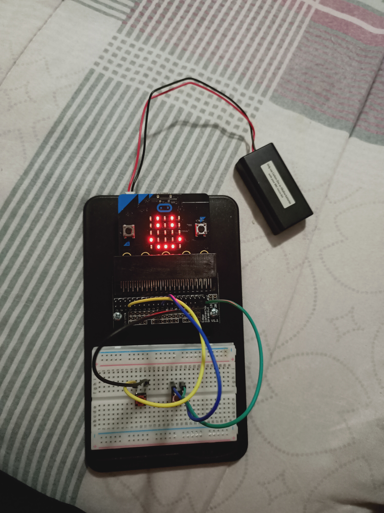
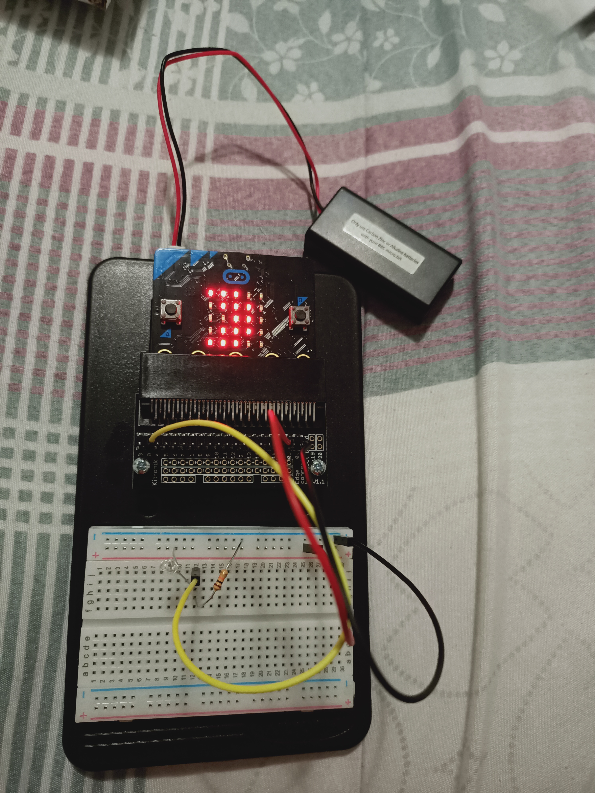
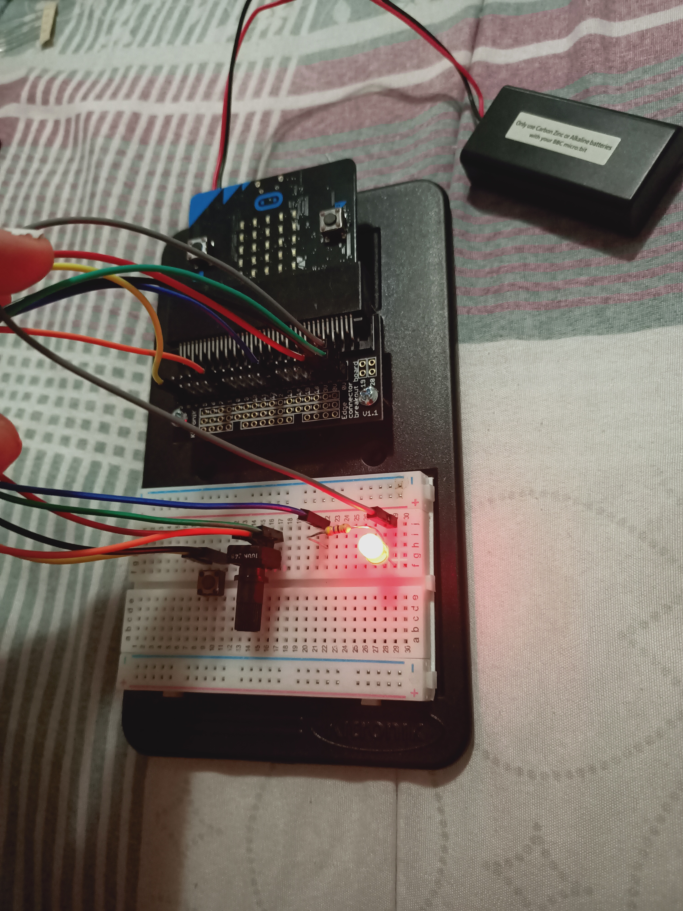
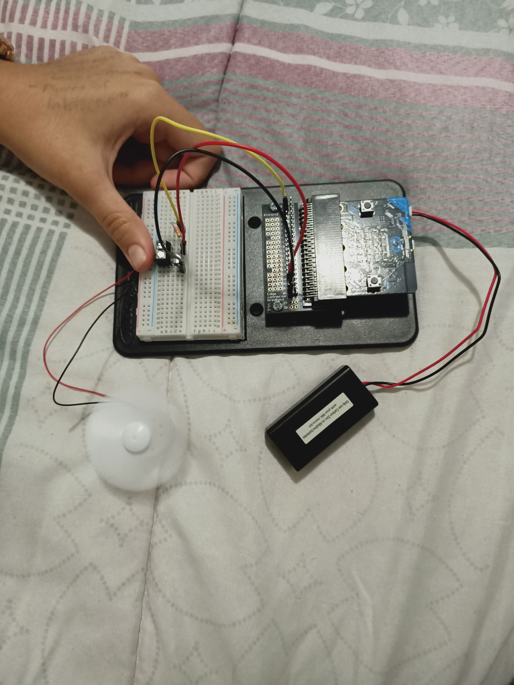

# Inventor Kit Experiments

*Markdown reference: https://guides.github.com/features/mastering-markdown/*

## Instructions ##

### SAY "HELLO" TO THE BBC micro:bit! ###

#### Photo of completed project ####

After pressing the SW1 button, a smiley face is displayed.

#### Reflection ####

In this experiment, something I learned was how to create a basic circuit on a breadboard.

This experiment could be the basis of a real world application such as displaying information outside of a business: opening hours, products, event times, etc.

### USING A LIGHT SENSOR & ANALOG INPUTS ###

#### Photo of completed project ####

The room had little light and therefore the micro:bit displayed a moon shape.

#### Reflection ####

In this experiment, something I learned was that a phototransistor is able to measure light and then can be coded to have different functions at different light levels.

This experiment could be the basis of a real world application such as light that are triggered by the absence of light or windows that appear darker in bright settings and clear in dark ones.

### DIMMING AN LED USING A POTENTIOMETER ###

#### Photo of completed project ####

The potentiometer is turned 3/4 of the way, presenting a reasonably bright light.

#### Reflection ####

In this experiment, something new to me was the complexity of the wiring and understanding how the circuit worked.

This experiment could be the basis of a real world application such as the dimming of lights in houses, screens, rgb hardware, etc.

### USING A TRANSISTOR TO DRIVE A MOTOR ###

#### Photo of completed project ####

The fan is increasingly rotating faster until it reaches maximum speed and then slows until it stops. This process is repeated

#### Reflection ####

In this experiment, something I learned was that various components can be connected to a microbit and coded individually.

This experiment could be the basis of a real world application such as fans self regulating their speed due to the proximity of an object in front of it. This particular project could also be developed into a regulates air rotation, therefore if there is a lack of air flow, the fan will speed up.

### SETTING THE TONE WITH A PIEZO BUZZER ###

#### Photo of completed project ####

The buzzer plays a tone whenever one of the buttons is pressed.

#### Reflection ####

In this experiment, something new to me was or something I learned was that you can either choose notes by picking from the MIDI keyboard or frequency which can incorporate math aswell.

This experiment could be the basis of a real world application such as personalised doorbells, ringtones, sensor-controlled-messages, etc.

