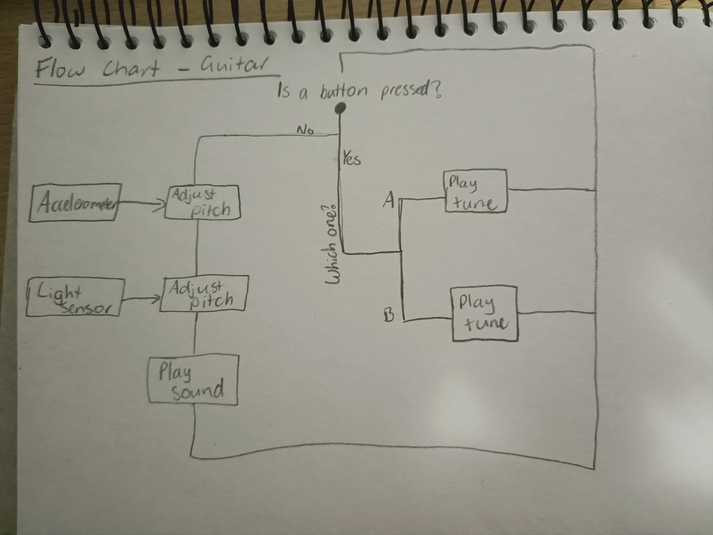

# Assessment 1: Replication project

*Markdown reference:* [https://guides.github.com/features/mastering-markdown/](http://guides.github.com/features/mastering-markdown/)

## Micro:bit Guitar ##

## Related projects ##

### Related project 1 ###
Mini DIY Cardboard iPod Boombox

https://au.pcmag.com/best-tech/19222/10-practical-gadgets-made-from-cardboard

This project is related to mine because it is made from cardboard and has a music-related function. It is much simpler than the guitar project but there are still difficult aspects like the design and precise measurements.

### Related project 2 ###
Cardboard Electric Guitar

https://www.instructables.com/id/Cardboard-Electric-Guitar/

This project is related to mine because the whole project, from function, materials and fabrication, the goal is very similar. The only difference is that instead of a micro:bit, he has used another form of technology to create sound.

### Related project 3 ###
Make a Cardboard MIDI Guitar with the Touch Board

https://www.bareconductive.com/make/make-a-midi-cardboard-guitar-with-the-touch-board/

This project is related to mine because the materials, fabrication and concept are very similar. The difference is that he has used a touch board instead of a light sensor and accelerometer to control the sound. The projects are both simple but very entertaining.

### Related project 4 ###
Creating A DIY Cardboard Guitar With Nintendo Labo

https://www.adsrsounds.com/news/creating-a-diy-cardboard-guitar-with-nintendo-labo/

This project is related to mine because the materials, fabrication and concept are similar; the reason for this being htey are both interactive guitars that are programmed to produce sound. This related project is actually very interesting because there is a touchscreen with keys that play the notes within a chord. The makers have taken this one step further by using the remote to control which chord the touchscreen will play, for example, if the analog stick is pushed to left, an A minor chord may play. This is all similar to my project except the micro:bit guitar has been coded to control the pitch automatically.

### Related project 5 ###
Pedometer (Arduino 101)

https://create.arduino.cc/projecthub/brudarko/pedometer-arduino-101-ef494b?ref=tag&ref_id=accelerometer&offset=13

This project is related to mine because it uses the accelerometer. In this related project, the accelerometer has been used as a step counter that provides the steps, distance and calories burned. In the guitar project, it has been used to control the tempo of the pitches produced.

### Related project 6 ###
Valentine's Sunflower

https://www.hackster.io/circuito-io-team/valentine-s-sunflower-3cdd90

This project is related to mine because it uses the light sensor as part of its technology. In this case, the light sensor has been used to open a flower during higher light levels and close it during lower ones. This is similar to my project because the light level controls the positioning of a motor for the flower and it controls the pitch of tone in the guitar.

## Reading reflections ##

### Reading: Don Norman, The Design of Everyday Things, Chapter 1 (The Psychopathology of Everyday Things) ###

Before the reading, I always believed that interactive objects were created for people to learn how to use them. I understood that some things were designed badly, for example: doors, and that this encouraged others to build them better, but I believed people just learnt to use whatever was placed in front of them and over time, be able to use it more effectively.

I learnt about signifiers and affordances and began to notice these things throughout my day in everyday objects, judging them all. If a door was not labelled, I would immediately be annoyed at it and begin to think on how I would change it. When using an application, I would notice the mappping of the pages and make a judgement based on how easy and efficient the navigation was. The most important for me was the feedback. I've always known that an elevator button turns coloured when pressed and a crossing button doesn't, but this realisation made me wonder the process behind crossing buttons; do they count the amount of pushes or only trigger an action like an elevator? Overall, this reading opened my mind to the design of everything.

I would like to know how this information has influenced everyday objects so far. There have been many references to doors, sinks and buttons being designed terribly but what has been changed and implemented into the world today? Have any of these designs significantly grown in popularity? Are some of them now used globally? These are all questions that I would like to learn more about.

This reading does somewhat relate to my project but can definitely be used to improve it. The micro:bit guitar already affords lifting, playing and entertainment and these signifiers are also present. Feedback is incorporated through the micro:bit LEDs which show light and axis levels. Some ways this reading could improve the overall quality of this project could be to add more feedback and visual/textual signs that let the user understand what is happening inside. This could be done in the form of instructions or small icons. There should also be more functions such as twisting buttons and levers that affect the sound and volume in order to make the project much more interactive.

### Reading: Chapter 1 of Dan Saffer, Microinteractions: Designing with Details, Chapter 1 ###

Before this reading I again believed that technology was made and then humans would have to learn to use it. This led me to believe that applications,software and websites never tried to make the interaction easy, but instead forced you to fail, learn and repeat. This was completely challenged by the reading because these microinteractions are designed to make interaction more effective, efficient and exceptional in general. They are meant to enhance websites, applications and software in order to provide a well refined interaction.

From this reading, I learned that microinteractions are just as vital as any other component because they add depth to functions, making it evident that time and effort were put in. This creates a professional 'look and feel' that adds value to a website/aplication. This added to my knowledge by introducing me to the importance of details and how they can improve quality significantly.

While microinteractions are extremely valuable and helpful, how does a developer know when there are enough? How do they not add too many? There are countless cases where these small details are not incorporated but when does it become too much and is there even a limit to how many there can be? I wonder about these questions because if the presence of microinteractions translates to a resolved website/application, then why don't developers go insane with the amount of them? The universal rules 'keep it simple' and 'less is more' both imply that a website is much better when there is less on the page, which is contradictory to my first questions. These are all questions and thoughts I have been left with from this reading.

The ideas in this reading do not directly correlate with my project but can be used to improve it. Smaller optional components could be added to increase the interactivity of the guitar. This could be done in the form of colourful lights that have a button to change the colours or a small library that can activate different songs with a specific gesture. Becuase this project is quite simple, there aren't many functions to which microinteractions can be added.

### Reading: Scott Sullivan, Prototyping Interactive Objects ###

Before this reading, I was aware of the 'testing, revising, refining' method that designers and developers used to reach a final solution but I was completely unaware that the testing phase could happen in public with real subjects. I always believed that there would be a few tests done by the developer themselves and then peers, and then end with an already refined prototype that would be used in public. This was challenged by the reading because their machine was tested in a store without much prior testing. This ensured that the reactions were genuine, unlike those of the designer themselves or peers.

This reading made me realise that this method of testing is much more effective. Through each test of the 'customer counter' there were different realisations and, therefore, always new ways to improve the over product. Throughout the experiment presented in the reading, there were plenty of errors found, for example: the creepy look of a camera taped under a table, the camera counting one person multiple times, etc. This also educated me in the importance of interaction design as the look of a product affects initial reactions and thoughts of functionality completely. Some people were scared of the camera under the table because of obvious safety reasons while others were unbothered, but when there is a camera pointing at you with a big red button and a 'photobooth' sign, people are happy to interact. This reading exposed me to human behaviour around machines and just how difficult it is to design something that everyone can enjoy.

There is one main question I have after this reading. Some people were spooked from the camera taped under the table but others were completely unbothered, even if they did notice. There is a wide variety of human behaviours and reactions so how is a developer suppose to cater to all humans when they design a product? In this reading, some spoke up pand talked to the store workers about it while others rushed out hurriedly. Since there are so many different variables when it comes to human interaction, how can anyone design a product that achieves the target reaction from everyone? It seems like an impossible question with no answer but I would be interested to hear if anyone even came close.

*How this relates to the project I am working on: Describe the connection between the ideas in the reading and one of your current projects or how ideas in the reading could be used to improve your project.*
This reading relates to my project but also could drastically improve it. It relates to the guitar because there were prototyping stages were multiple layers had to be made, fixed or duplicated because of issues fitting together or looking incorrect. There were many attempts at creating a suitable design and making sure it still looked attractive. A peer testing phase was also implemented to gain initial reactions of the guitar. The way the ideas in this reading could improve the guitar is by recieving feedback from strangers or engaging in a critique session. These methods would have pointed out flaws and much needed improvements.

## Interaction flowchart ##

## Process documentation

The development phase of this project began with the coding. I copied the code provided by micro:bit's guitar tutorial and only changed the tones of the buttons.

I then used online sources to find the notes for the desired songs I wanted to replicate for the buttons.

*Websites are: https://easy-letter-notes.com/stairway-to-heaven/ and https://noobnotes.net/careless-whisper-george-michael/*
After this, the code was finished and the physical object had to be built.

This process began and an immediate issue arrised. The guitar tutorial required alligator clips and I did not own any so I drove to Bunnings and bought alligator clips and some wire which were put together by using pliers.

Then a sketch was made of an electrical guitar and redrawn onto cardboard. Two of these were cut out.

A hole was cut into the back piece in order to create an access panel to the electricals that would be placed inside.

Another smaller shape was added to the front piece for style and a hole was cut out as a place to display the micro:bit.

On the inside of the front piece, the removal of some cardboard was necessary in order fit the micro:bit, alligator clips and battery pack port.

A circular shape was cut from the front piece in order for the speaker to fit inside. A thin strip of cardboard was left down the middle to hold the speaker while the alligator clips attached from the inside.

Side pieces were made in order to make the guitar more dimensional. These pieces were secured with tape and glue in order to ensure that it held the complex shape.

A neck was then cut from the cardboard. The top side had a flat, straight piece while the bottom was much wider. This was so the neck would also be more three dimensional, curving around to make a semi-circular shape.

After this had been attached, a design was put on the guitar to reflect the sound. I felt this particular pattern was trendy, chaotic and nailed the crazy sound of the guitar. It was not placed arounf the entire guitar because I worried it would look to busy and the carboard added a really nice colour.

After this, the shell was complete! The micro:bit battery pack and alligator clips were secured with tape and then it was ready to play.

## Project outcome ##

### Micro:bit Guitar ###

### Project description ###

This project is an electronic guitar that has been coded to produce different frequencies, depending on the light level and axis/positioning of the guitar. This is due to the use of the accelerometer and light sensor on the micro:bit, reacting by producing different frequencies. The accelerometer is responsible for changing the tempo, depending on the orientation and posistioning while the light sensor controls the pitch of the sound produced by the guitar. This project does not have a targeted audience or age range as anyone can play. This is much lighter than a regular guitar and very easy to play, therefore all age groups are able to have a turn. Because it is an instrument, the primary use is entertainment but this could also be an educational project as well, teaching the functions and uses of the micro:bit and its parts.

### Showcase image ###

### Additional view ###

### Reflection ###

The parts of the project that were successful was the fabrication and final look of the guitar. I was very happy with the design on the guitar and the peer feedback supported this. Another successful aspect was how the guitar came together and how the circuitry fit so well within it. On the other hand, everything could have been improved. While this was only meant to be a prototype, the body, especially the neck, could have been improved to make a more realistic shape. The code could have been adjusted to be better calibrate the light sensor for the environment it was used in. There also could have been more detailing on the neck to better blend with the body.

The related projects helped me understand that the project given is not to create a working instrument from cardboard, but instead to produce an electronic instrument. This concept was actually quite difficult to understand in the beginning because I could only visualise an acoustic or electric guitar with strings. The related projects helped with this becuase their guitars taught me that the physical object is designed to give the user an understanding of the projects uses while the technology provides the rest. The other guitar related projects also helped me decide that I wanted a three-dimensional guitar rather than a thin piece of cardboard. This was due to the fact that it looked unappealing and the three-dimensional design was much closer to the look and feel of an acoustic/electric guitar. I found these other projects helpful because their methods and design ideas influenced my decisions greatly.

One of the readings, Dan Saffer's *Designing with Details*, was one of the greatest influences of my decisions during the project because it taught me to put in the effort and time to create a well refined solution. Many details could have been skipped but this particular reading guided my thinking which produced a much better outcome. Related projects 2-4 also influenced my decisions greatly as their outcomes provided some insight into possible problems and their solutions. These related projects were really examples from which I could extract the parts I liked and discard the rest and that enhanced the overall outcome of my guitar.

An interesting extension of this project could be to make a game similar to Guitar Hero, where the guitar is suppose to reflect the moves indicated on a screen. The light sensor would detect whether a hand is in front which can be used for strumming and the accelerometer can detect moves such as a guitar spin or shaking. There can also be other features added to the guitar such as a whammy bar or buttons to change the sound. This project can also be designed for easy use by the disabled. Since this guitar relies on movement, light and any other added features, no skill is needed to play it and, therefore, the newer features can cater to all audiences, including the disabled. Once this extension is made, it can then be used in homes, arcades, festivals or any event.
